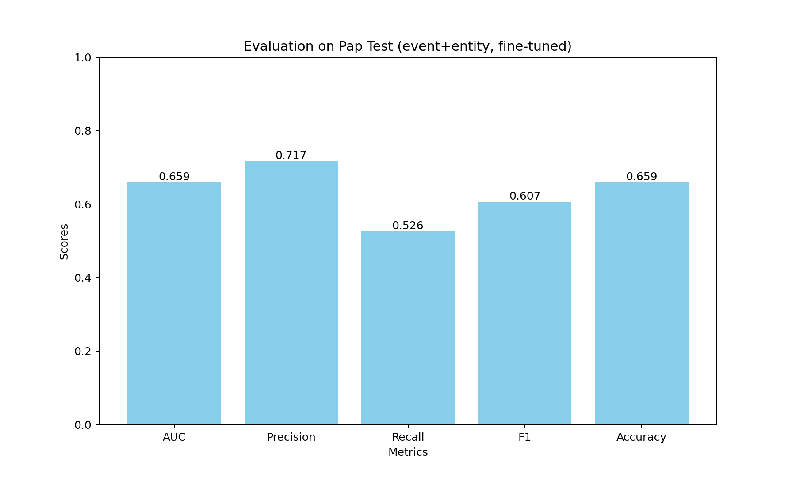
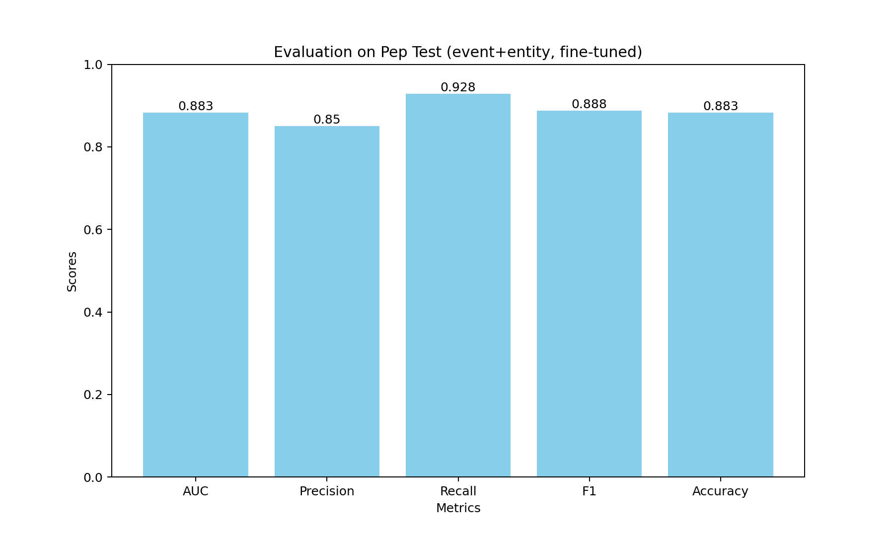
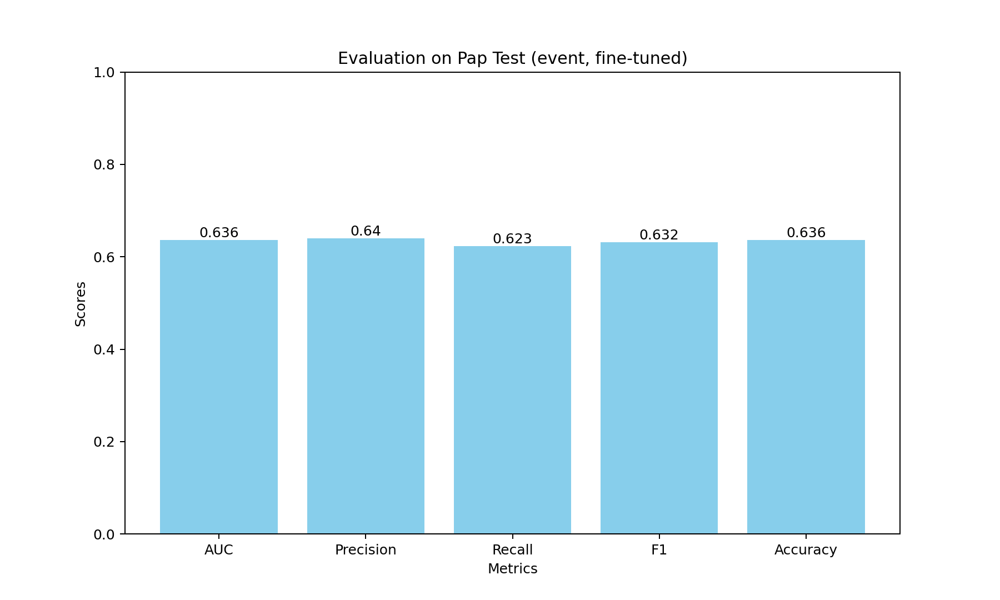
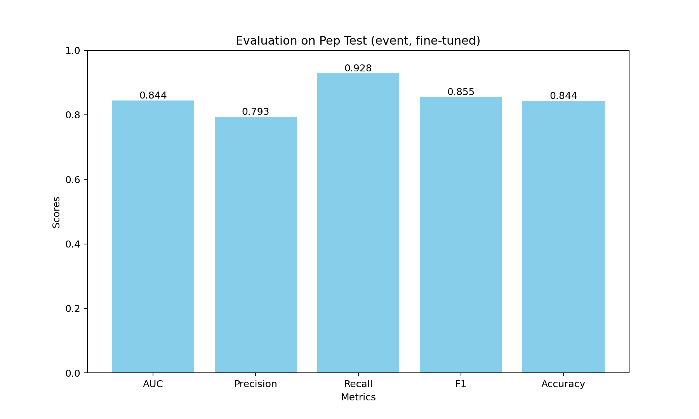
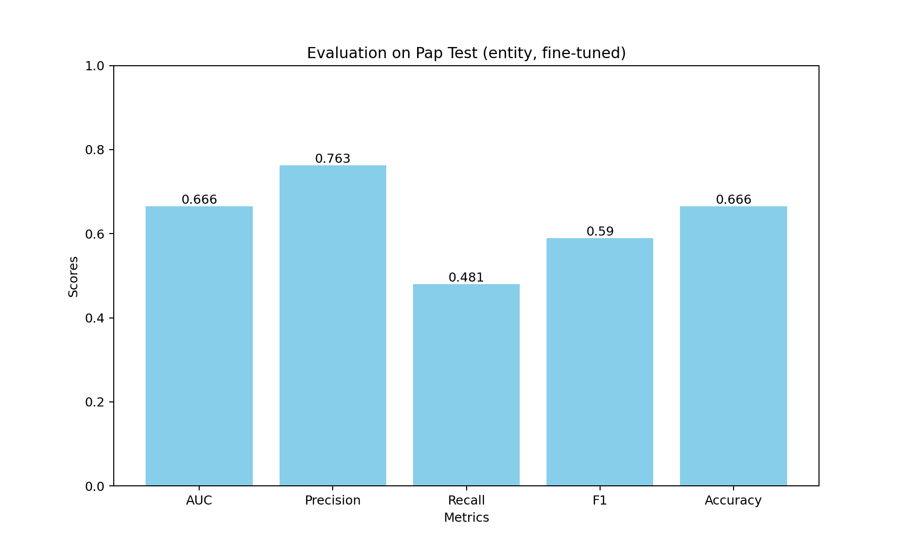
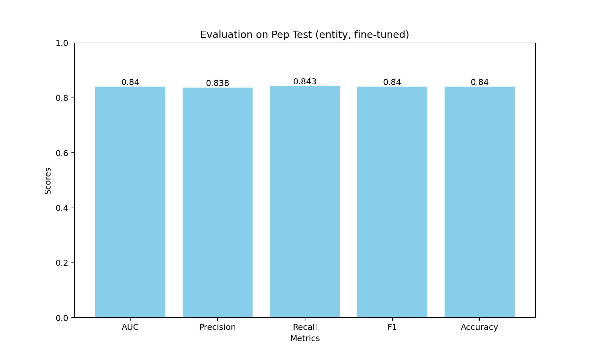

# Finetuning
## Event and Entity
Fine-tune RoBERTa on the augmented, preprocessed (s,v,o)-events, with event type and entity type knowledge injected.
### Usage
- Fine-tune:
  - Download the pre-trained model from [HuggingFace](https://huggingface.co/roberta-large) and save it in `../cache/`
- Inference and Evaluation:
  - Download and unzip the fine-tuned model checkpoint `ckpt_evt+ent.zip` from [Google Drive](https://drive.google.com/drive/folders/1fQdsoY6q5EG4Dkwyj7kD8KCHctVbAkbE?usp=sharing) to `./evt+ent/output/`
- Run the code in `./evt+ent/finetune_5-2_1_3_new.ipynb`.
### Results

    

# Ablation Study
## Event
Fine-tune RoBERTa on the augmented, preprocessed (s,v,o)-events, with only event type knowledge injected.
### Usage
- Fine-tune:
  - Download the pre-trained model from [HuggingFace](https://huggingface.co/roberta-large) and save it in `../cache/`
- Inference and Evaluation:
  - Download and unzip the fine-tuned model checkpoint `ckpt_evt.zip` from [Google Drive](https://drive.google.com/drive/folders/1fQdsoY6q5EG4Dkwyj7kD8KCHctVbAkbE?usp=sharing) to `./evt/output/`
- Run the code in `./evt/finetune_5-2_3_1.ipynb`
### Results

    

## Entity
Fine-tune RoBERTa on the augmented, preprocessed (s,v,o)-events, with only entity type knowledge injected.
### Usage
- Fine-tune:
  - Download the pre-trained model from [HuggingFace](https://huggingface.co/roberta-large) and save it in `../cache/`
- Inference and Evaluation:
  - Download and unzip the fine-tuned model checkpoint `ckpt_ent.zip` from [Google Drive](https://drive.google.com/drive/folders/1fQdsoY6q5EG4Dkwyj7kD8KCHctVbAkbE?usp=sharing) to `./ent/output/`
- Run the code in `./ent/finetune_5-2_4_1.ipynb`
### Results

    

