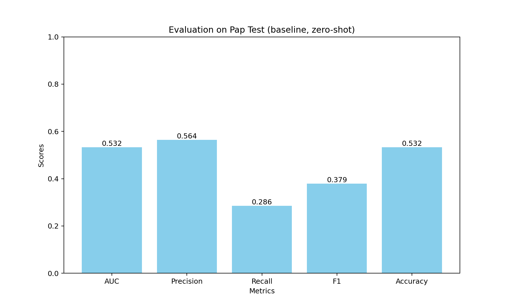
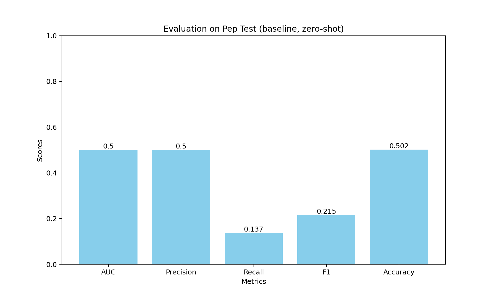
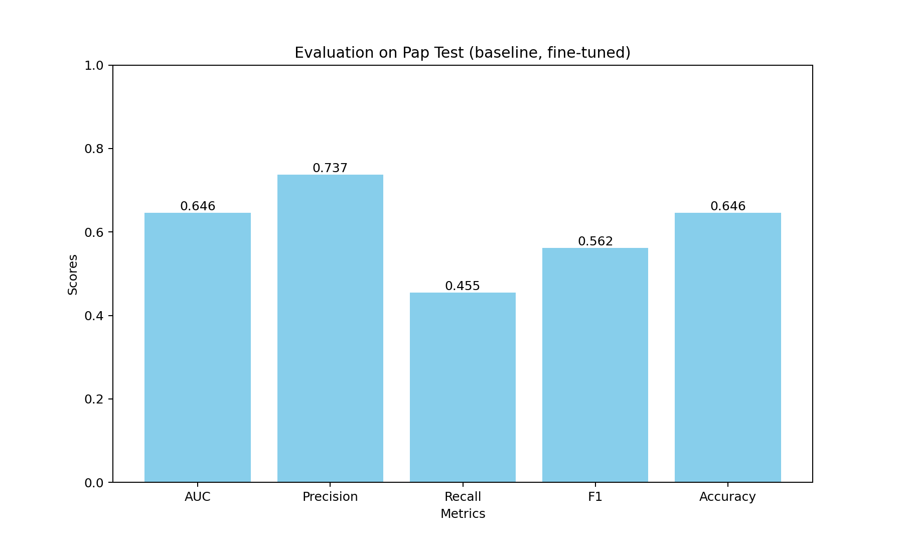
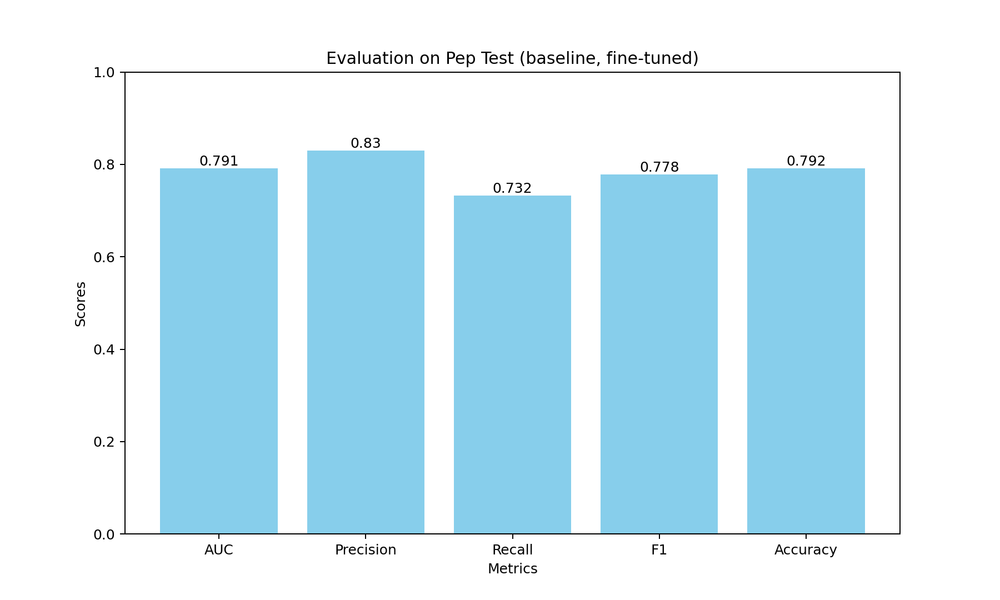

# Baselines
## Zero-shot Inference with RoBERTa
### Results

    

    

### Evaluates Roberta in a zero-shot manner, we use this system as a baseline model.
### When running this script, remember to configure the data path with your directory.
## Finetuning with labelled data.ipynb
### We finedtuend Roberta with PAP and PEP-3k datasets
### When running this script, remember to configure the data path with your directory.
## Datasets
### The finetuning datasets can be found under datasets/preprocessed/baseline
