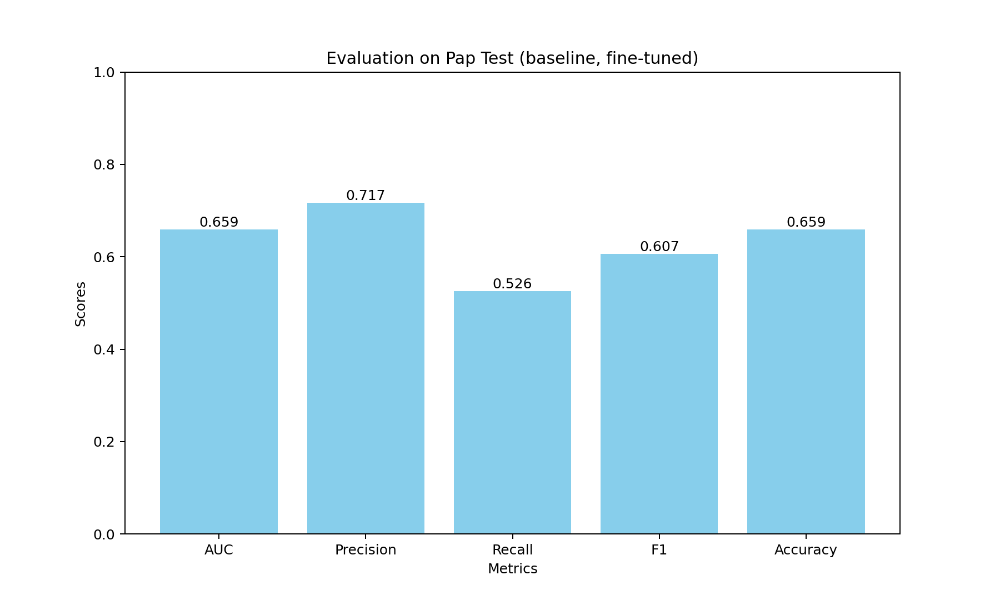
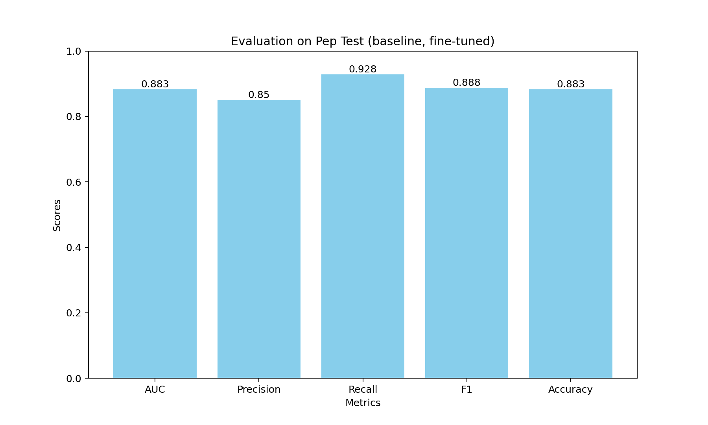

# Finetuning
## Event and Entity
Fine-tune RoBERTa on the augmented, preprocessed (s,v,o)-events, with event type and entity type knowledge injected.
### Usage
Run the code in evt_ent/finetune_5-2_1_3_new.ipynb
### Results

    

